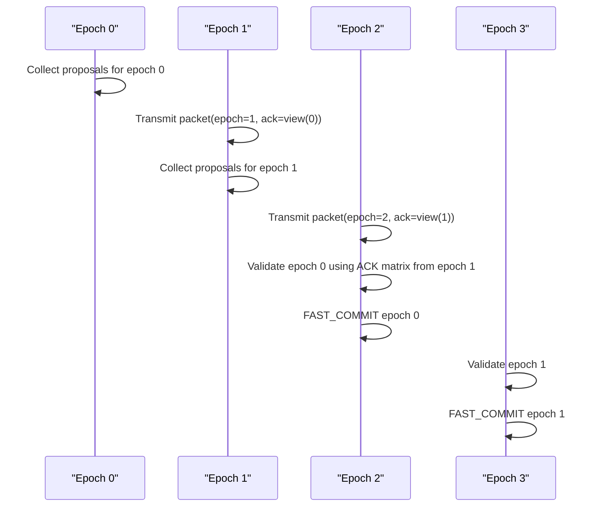

# Project Specification: Safe-ABSC (Adaptive Bound Synchronous Consensus)
**Version:** 1.0 (Pipelined Hardware-Software Co-Design)
**Target:** FPGA (Fast-Path) + Host CPU (Slow-Path Recovery)

## 1. Project Objective
The primary goal of this project is to build a high-performance, deterministic Replicated State Machine (RSM) by shifting the consensus paradigm from traditional event-triggered software voting (e.g., Raft/Paxos) to a **time-triggered hardware architecture**. 

We employ a **Bimodal Architecture**:
* **Hardware Fast-Path (FPGA NIC):** Handles 99.9% of normal traffic. By leveraging synchronized PTP clocks and an adaptive network bound ($\Delta$), the FPGA enforces strict "Time-Fences." It uses boolean matrix cross-validation to achieve single-hop, microsecond-level consensus without CPU involvement.
* **Software Slow-Path (Host CPU):** Handles the 0.1% edge cases (e.g., severe asymmetric network congestion or node crashes). If the FPGA detects any view inconsistency at the time-fence, it strictly performs a "Fail-Stop," flushing the hardware pipeline and triggering an MSI-X interrupt. The host CPU then utilizes an asynchronous protocol (e.g., Raft) to safely recover the state.

## 2. System Assumptions & Global Parameters
* **Clock Synchronization:** All nodes possess a highly synchronized global clock (e.g., via Precision Time Protocol - PTP). Global time is denoted as $T$.
* **Time Epochs:** Time is discretized into fixed intervals called Epochs, denoted by $E$. The duration of an epoch is $\Delta$ (the expected network latency bound). The current epoch is defined as $E = \lfloor T / \Delta \rfloor$.
* **Cluster Size:** The system consists of $N$ nodes, indexed from $0$ to $N-1$.
* **Quorum:** The majority required for liveness is $Q = \lfloor N/2 \rfloor + 1$.


## 3. Packet Format (Piggybacking Design)
To maximize throughput and hide network latency, the protocol is highly pipelined. A single UDP broadcast packet carries both the proposal for the current epoch and the acknowledgment for the previous epoch.

```text
struct Packet {
    uint64_t epoch_id;      // The current epoch E
    uint32_t src_id;        // Node ID of the sender
    uint8_t  ack_bitmap[N]; // Piggybacked acknowledgment view of epoch E-1
    payload_t data;         // The actual proposal payload for epoch E
};
```

## 4. Hardware State Registers (FPGA Data Plane)
The FPGA implements a sliding window of depth 3 to manage the pipeline: Current Stage ($E$), Ack Stage ($E-1$), and Commit Stage ($E-2$). The following registers are maintained per node:

* `STATUS`: Enum `[RUNNING, HALTED]`. Default is `RUNNING`.
* **Stage 1: Proposal Collection ($E$)**
    * `My_Bitmap_E`: A 1D bit-vector of length $N$. Bit $i$ is set to 1 if a valid proposal is received from Node $i$ during epoch $E$.
    * `Proposals_E`: Buffer storing the payloads received in epoch $E$.
* **Stage 2: Acknowledgment Matrix ($E-1$)**
    * `My_Bitmap_E_minus_1`: Locked view of the previous epoch.
    * `Ack_Matrix_E_minus_1`: A 2D matrix of $N \times N$. Row $i$ stores the `ack_bitmap` received from Node $i$ during epoch $E$.
* **Stage 3: Commit Validation ($E-2$)**
    * `My_Bitmap_E_minus_2`: View of epoch $E-2$.
    * `Ack_Matrix_E_minus_2`: The fully populated matrix for epoch $E-2$.

## 5. Time-Triggered Execution Rules
The FPGA logic is driven by the PTP clock. If `STATUS == HALTED`, all network transmission and reception are blocked.

### Rule A: Epoch Boundary Transition (Triggered exactly at $T \bmod \Delta == 0$)
When the global clock crosses into a new epoch $E$:
1.  **Pipeline Shift:** * Data in Stage 2 ($E-1$) shifts to Stage 3 ($E-2$).
    * Data in Stage 1 ($E$) shifts to Stage 2 ($E-1$). `My_Bitmap_E` becomes strictly **Read-Only**.
    * Initialize Stage 1 ($E+1$) with zeros. Self-receive bit is set: `My_Bitmap_E_plus_1[My_ID] = 1`.
2.  **Commit Evaluation:** Execute **Rule C** for Stage 3 ($E-2$).
3.  **Transmission:** Assemble a new `Packet`. Set `epoch_id = E`, attach the new local payload, and set `ack_bitmap = My_Bitmap_E_minus_1`. Multicast to all $N$ nodes.

### Rule B: Packet Reception (Continuous Combinational Logic)
Upon receiving a `Packet(rx_epoch, rx_src, rx_ack_bitmap, rx_payload)`:
1.  **Demultiplexer:** * If `rx_epoch == Current_Epoch`: Write `rx_payload` to `Proposals_E` and assert `My_Bitmap_E[rx_src] = 1`.
    * Extract the piggybacked `rx_ack_bitmap` (which belongs to the previous epoch) and write it to `Ack_Matrix_E_minus_1[rx_src]`.
2.  **Out-of-Bounds Rejection:** If `rx_epoch < Current_Epoch - 1`, the packet is severely delayed and is silently dropped by the hardware.

### Rule C: Commit Gate Validation (Combinational Boolean Check)
At the epoch boundary, evaluate the safety of epoch $E-2$:
1.  **Liveness Check:** Count the number of non-zero rows in `Ack_Matrix_E_minus_2`. Let this be $C$.
2.  **View Consistency (Safety) Check:** For every Node $i$ that sent an ACK (row $i$ is non-zero), assert `Ack_Matrix_E_minus_2[i] == My_Bitmap_E_minus_2`.
3.  **Decision:**
    * If ($C \ge Q$) AND (All received views match perfectly): Trigger **FAST_COMMIT**. DMA the validated payloads to the Host memory.
    * If ($C < Q$) OR (Any view mismatch is detected): Trigger **Rule D**.

### Rule D: Failure Handling (Fail-Stop)
If the hardware detects asymmetric jitter or a split-brain attempt:
1.  Set `STATUS = HALTED`.
2.  Trigger an MSI-X hardware interrupt to the Host CPU.
3.  Write the conflicting `Ack_Matrix` and the failed `Epoch_ID` to a ring buffer for software diagnostics.
4.  Flush all in-flight pipelines. The hardware will remain dormant until the Host CPU resolves the inconsistency and issues a reset command with a synchronized starting epoch.

### Fail-Stop Policy Clarification
The fast path should not halt merely because one node is missing. The correct halt policy is based on whether the hardware can still prove a single consistent majority view for the epoch under validation.

The hardware should continue running when:
* Some nodes crash, omit transmissions, or become unreachable.
* The remaining ACK rows still contain a quorum, `C >= Q`.
* Every non-zero ACK row matches the local `My_Bitmap_E_minus_2`.

The hardware must fail-stop when either of the following holds:
* **No quorum:** fewer than `Q` non-zero ACK rows are available for the epoch under validation.
* **View mismatch:** any received non-zero ACK row differs from the local `My_Bitmap_E_minus_2`.

This means the decision boundary is:

```text
if C < Q:
    FAIL_STOP
elif exists nonzero row i such that Ack_Matrix_E_minus_2[i] != My_Bitmap_E_minus_2:
    FAIL_STOP
else:
    FAST_COMMIT
```

Operationally:
* A minority crash fault is tolerable if a consistent quorum remains.
* Asymmetric visibility is not tolerable, because it means different nodes may be validating different membership views.
* Losing quorum is also not tolerable, because the hardware fast path can no longer guarantee safe progress.

### Epoch Timeline
The protocol is easiest to reason about as a fixed 3-stage pipeline. At epoch boundary `E`, the node sends the proposal for `E`, carries the ACK bitmap for `E-1`, and validates whether `E-2` can be committed.

```text
Boundary at epoch E:

commit stage     ack stage        collect stage       outgoing packet
------------     ---------        -------------       -----------------------------
validate E-2  <- locked view E-1 <- receive props E   tx(epoch=E, ack=bitmap(E-1))
```

For a healthy run, the timeline looks like this:



The important consequence is that commit is intentionally delayed by two epochs. A proposal first appears in collect stage, then its view is echoed in the next epoch's ACK bitmap, and only then is it safe to validate.

### Scenario Timelines
The current simulator scenarios are easier to interpret with a few canonical timing sketches.

#### 1. Minority Crash, Quorum Survives
If one node crashes but the remaining nodes still exchange the same view, the fast path should continue.

```text
epoch 0: all 3 nodes collect the same view
epoch 1: node 2 crashes, nodes 0 and 1 still exchange matching ack(view(0))
epoch 2: nodes 0 and 1 validate epoch 0 with C=2, Q=2 -> FAST_COMMIT
epoch 3: nodes 0 and 1 validate epoch 1 -> FAST_COMMIT
```

This is the `node2_crash` case in the Python model.

#### 2. Future-Epoch Skew
If one node crosses the epoch boundary too early and labels an epoch-0 transmission as epoch 1, other nodes build different views for epoch 0.

```text
epoch 0:
  node 0 sees {0,1}
  node 1 sees {0,1}
  node 2 sees {0,1,2}

epoch 1:
  nodes exchange ack(view(0))
  node 2 advertises 111, nodes 0 and 1 advertise 011

epoch 2:
  validation of epoch 0 detects mismatched ACK rows -> FAIL_STOP
```

This is the `future_epoch_skew` case and is a good mental model for clock-boundary mistakes.

#### 3. Quorum Loss
If too many nodes disappear, the surviving node does not get to "commit what it already saw" unless the validation window still has quorum.

```text
epoch 0: all 3 nodes collect proposals
epoch 1: two nodes crash before sending ack(view(0))
epoch 2: survivor validates epoch 0 with C=1, Q=2 -> FAIL_STOP
```

This is why the protocol checks the ACK matrix for the validation window, not just the original proposal bitmap.

## 6. Python Reference Simulator
The repository also contains a protocol-level reference model. The protocol implementation now lives under `sim/core/`, while `sim/syncons.py` and `sim/run_scenario.py` are thin CLI entrypoints.

Example runs:

```bash
python3 -m pip install -r requirements-dev.txt
python3 sim/syncons.py perfect
python3 sim/run_scenario.py perfect --check
python3 sim/syncons.py asymmetric_loss --show-trace
python3 sim/syncons.py node2_crash --json
python3 sim/syncons.py quorum_loss --check
python3 sim/syncons.py controlled_rejoin --check
python3 -m pytest
```

Built-in scenarios currently cover:
* `perfect`: all packets arrive within the same epoch.
* `node2_crash`: one node crashes after epoch 0 while a quorum survives.
* `asymmetric_loss`: one asymmetric packet loss creates an ACK view mismatch and triggers fail-stop.
* `one_epoch_delay`: a packet arrives one epoch late and is ignored by the current collector.
* `quorum_loss`: two nodes crash and the remaining node halts because quorum is no longer available.
* `stale_replay`: an old packet is replayed in a later epoch and is dropped as stale.
* `duplicate_same_epoch`: a duplicated packet arrives in the same epoch and should not change the outcome.
* `future_epoch_skew`: one node crosses an epoch boundary too early and labels a packet with the next epoch id.
* `ack_bitmap_corruption`: an ACK bitmap is corrupted for one receiver at the validation boundary, causing that node to fail-stop.
* `controlled_rejoin`: a crashed node is kept out of the fast path during recovery and is only reactivated at an explicit epoch boundary.

Use `--check` to compare a scenario run against its built-in expected outcome and make the simulator act like a lightweight protocol regression test.

Recommended structure:
* `fpga/rtl/`: FPGA RTL modules.
* `fpga/tb/`: FPGA-oriented Verilog testbenches.
* `fpga/Makefile`: FPGA/RTL simulation entrypoint.
* `sim/core/types.py`: shared protocol datatypes and scenario expectations.
* `sim/core/node.py`: the single-node sliding-window state machine.
* `sim/core/cluster.py`: multi-node runner and in-flight delivery queue.
* `sim/core/faults.py`: fault and activity models.
* `sim/core/scenarios.py`: named scenarios and expected results.
* `tests/test_*.py`: scenario validation split into separate pytest files.

The current Python model also tracks:
* `membership_epoch`
* `active_membership`
* per-node control-plane membership state (`ACTIVE`, `FAILED`, `RECOVERING`, `REJOIN_PENDING`)

For validation:
* Create an isolated environment with `python3 -m venv .venv`
* Activate it with `source .venv/bin/activate`
* Install dev dependencies with `python3 -m pip install -r requirements-dev.txt`
* Run all protocol regressions with `python3 -m pytest`

For FPGA RTL simulation:
* Run the cluster-level RTL simulation with `make -C fpga run`
* Run the core-only RTL simulation with `make -C fpga tb_core`

## 7. Failure, Recovery, and Rejoin
The fast path should not treat "a node is sending packets again" as sufficient evidence that the node is safe to accept. A restarted node may be missing committed log entries, may have an outdated membership view, and may produce ACKs that pollute the validation window.

Therefore:

```text
Fast-path membership is control-plane managed, not self-announced.
```

### 7.1 Core Rule
A node is allowed to contribute proposals and ACK rows to the hardware fast path only when the control plane marks it as an active member of the current configuration.

This means:
* A node that crashes is removed from the active fast-path membership.
* A node that reboots does not automatically regain membership.
* A recovered node must complete log/state recovery first.
* The control plane must explicitly authorize rejoin.
* Rejoin must take effect only at a clean epoch boundary.

### 7.2 Membership State
In addition to the local FPGA datapath state (`RUNNING` or `HALTED`), each node should have a control-plane membership state:

* `ACTIVE`: the node is allowed to send and receive fast-path packets.
* `FAILED`: the node has been declared failed and is not accepted by the fast path.
* `RECOVERING`: the node has rebooted or been reset and is replaying or synchronizing state.
* `REJOIN_PENDING`: the node is locally recovered, but the cluster has not yet activated it in the current membership configuration.

Operational interpretation:
* Only `ACTIVE` nodes contribute to `My_Bitmap`, `Ack_Matrix`, and quorum checks.
* Packets from `FAILED`, `RECOVERING`, or `REJOIN_PENDING` nodes are ignored by the fast path.

### 7.3 Active Membership and Membership Epoch
The protocol should explicitly track the set of nodes that are eligible to participate in the fast path.

Suggested control-plane metadata:

```text
Active_Membership   := set of node IDs currently allowed in the fast path
Membership_Epoch    := monotonically increasing configuration version
Effective_Epoch     := protocol epoch at which a new configuration becomes active
```

Every time the control plane:
* removes a failed node, or
* re-adds a recovered node,

it should advance `Membership_Epoch` and distribute the new configuration to healthy nodes.

Suggested packet extension:

```text
struct Packet {
    uint64_t epoch_id;
    uint32_t src_id;
    uint32_t incarnation_id;
    uint32_t membership_epoch;
    uint8_t  ack_bitmap[N];
    payload_t data;
};
```

Suggested receive-side acceptance rules:
* If `src_id` is not in `Active_Membership`, drop the packet.
* If `membership_epoch != local_membership_epoch`, drop the packet or hand it to the control plane.
* If `incarnation_id` does not match the currently approved incarnation for `src_id`, drop the packet.
* Only ACK rows from active members in the current membership configuration contribute to validation.

This prevents a node that failed at epoch `m` and suddenly reappears at epoch `n` from being silently accepted into the fast path.

### 7.4 Why Spontaneous Rejoin Is Unsafe
If a previously failed node simply starts sending ACKs again, it may:
* lack committed log entries,
* hold an outdated `E-1` or `E-2` view,
* use an obsolete membership configuration,
* reintroduce stale or conflicting ACK rows into the validation matrix.

As a result, spontaneous rejoin can cause:
* false fail-stop events,
* incorrect exclusion or inclusion of members,
* or, in the worst case, unsafe commit decisions if configuration control is weak.

So the rule should be:

```text
A restarted node is not trusted by the fast path until the control plane explicitly reactivates it.
```

### 7.5 Recovery and Rejoin Flow
Recommended control-plane-mediated recovery flow:

1. Failure detection
   The fast path detects view inconsistency, quorum loss, or repeated node absence, and raises an interrupt or status event to the control plane.
2. Membership update
   The control plane marks the failed node as `FAILED`, removes it from `Active_Membership`, increments `Membership_Epoch`, and distributes the new configuration.
3. Node restart
   The failed node comes back up in `RECOVERING`, not `ACTIVE`.
4. Log and state repair
   The control plane or software slow path replays committed log entries, restores state, and synchronizes the node to the current committed point and membership configuration.
5. Rejoin approval
   After recovery completes, the node enters `REJOIN_PENDING`.
6. Fence-aligned activation
   The control plane announces that the node becomes `ACTIVE` starting at a specific epoch boundary, together with a new `Membership_Epoch`.

### 7.6 Epoch-Boundary Activation Rule
Membership changes should not become active in the middle of an epoch.

Required rule:

```text
Membership changes only take effect at epoch boundaries.
```

That means the control plane should issue a decision of the form:

```text
membership_epoch K with active_membership M becomes effective at protocol epoch E_effective
```

For a rejoin operation, this can be specialized as:

```text
node X becomes ACTIVE in membership_epoch K starting at protocol epoch E_rejoin
```

and all healthy nodes should begin accepting that node only from epoch `E_rejoin` onward.

This keeps the sliding window well-defined:
* `E` collection uses one fixed membership view,
* `E-1` ACK interpretation uses one fixed membership view,
* `E-2` commit validation uses one fixed membership view.

Without this rule, the 3-stage pipeline could mix different configurations inside one validation window.

Recommended control-plane object:

```text
MembershipConfig {
    membership_epoch
    active_membership
    approved_incarnations[src_id]
    effective_epoch
}
```

Fast-path rule:

```text
A node must not transmit or accept packets under a new membership_epoch
before the corresponding effective_epoch is reached.
```

### 7.7 Optional Incarnation ID
If a node may reboot multiple times while keeping the same logical node ID, the design may benefit from an incarnation identifier.

Suggested tuple:

```text
(src_id, incarnation_id)
```

The control plane can then explicitly say which incarnation is currently valid. Old packets from prior incarnations are ignored even if they use the same node ID.

Recommended rule:

```text
Approved_Incarnation[src_id] := the only incarnation currently trusted for that node ID
```

So a packet is accepted only if all of the following hold:
* `src_id` is active in the current membership.
* `packet.membership_epoch == local.membership_epoch`.
* `packet.incarnation_id == Approved_Incarnation[src_id]`.
* the current protocol epoch is at or beyond the configuration's `effective_epoch`.

This prevents stale packets from an older reboot of the same node from being mistaken for packets from the currently approved instance.

This is not strictly required for the first simulator version, but it is now a recommended part of the full protocol design.

### 7.8 State Sketch
The following simplified state machine captures the intended rejoin policy:

```text
FAILED -> RECOVERING -> REJOIN_PENDING -> ACTIVE
   ^                                  |
   |__________________________________|
             on new failure
```

Semantics:
* `FAILED -> RECOVERING`: node reboot or reset begins.
* `RECOVERING -> REJOIN_PENDING`: local recovery is complete, but cluster acceptance is still pending.
* `REJOIN_PENDING -> ACTIVE`: control plane activates the node at a chosen epoch boundary.
* `ACTIVE -> FAILED`: any new crash or explicit removal.

### 7.9 Consequence for the Fast Path
The quorum rule should be evaluated over the active membership for the current configuration, not over every physically powered-on node.

In other words:
* a failed node that reappears early does not count toward quorum,
* does not get an ACK row in the accepted matrix,
* and does not change `My_Bitmap` until the control plane admits it back into the cluster.
* a packet from an old incarnation of a node is also ignored even if that node ID is active.
